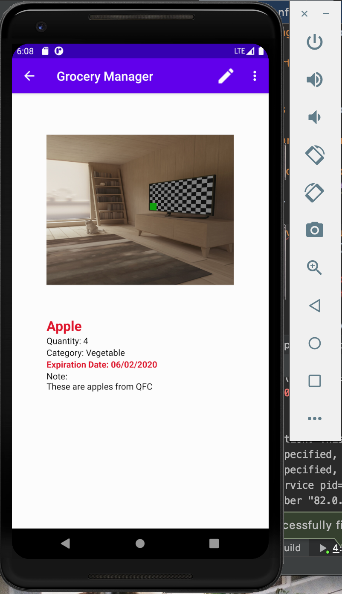

# INFO448: Android Development - Final-Project

# Grocery Manager

## Developer: Lizzy Chen, Eric Ng, Yuchen Wang, William Rodriguez

### Description:
The United States is the global leader in food waste, with nearly 40 million tons of food wasted every year. Essentially, 80 billion pounds of the food wasted equates to more than $161 billion dollars, or 219 pounds of waste per percent and 30% to 40% of the United States Supply Chain. Our android mobile application, **Grocery Manager**, is a produce manager application that is designed to record the shelf life of groceries that a user has in order to prevent food waste. Users can add food items to a list that they have and can set a picture, quantity, description, and an expiration dates for each item. When an item is close to the expiration date, the app will send a notification to the user, letting them know that the item will soon expire. Our goal for the mobile app is to prevent as much food waste as possible for those who may have trouble keeping track of the foods they have.

### Functionality:

1. Add and delete food items to a list
1. Items created can have a name, quantity, picture, expiration date, and a description attached
1. Supports sort and search for items in the list
1. Settings that allows the user to change their profile information like user, customize their UI with supported dark mode theme, or sign out of their account.
1. Includes a statistic feature that allows the user to have an analytical view on how their habits are for saving and wasting the foods they own.
1. Gives greetings to the user to stay healthy.
1. Send notifications to user on the expiration date of each item in the list. 

### Sreenshots/Gif:

